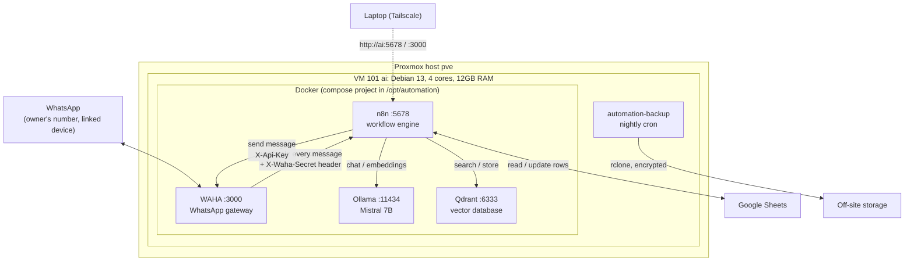
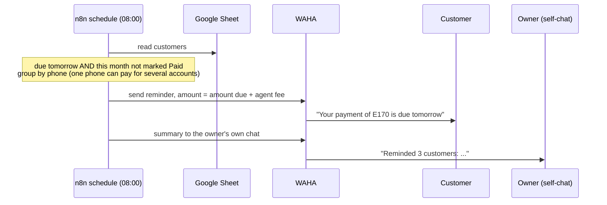

# System design: the `ai` automation server

How the automation server is built, why each piece was chosen, what it costs in memory, and what
went wrong on the way. It is written to teach from: each section explains the idea as well as the
setting.

It is updated with every change to the system, and the git history of this repo is the detailed
record. Business data (customer names, numbers, the spreadsheet itself) never goes in this repo,
which is public.

**Last updated:** 2026-10-07

---

## 1. What the system does

One virtual machine runs **n8n**, a workflow engine, and the services its workflows need: a local
language model, a vector database and a WhatsApp gateway. Workflows built in n8n automate real
work. The first two are:

1. **A RAG chatbot**: answers questions from a private knowledge base (the original
   [`n8n-chatbot`](https://github.com/Olwethu-Dlamini/n8n-chatbot) project, moving onto this server).
2. **A payment-reminder bot for a small subscription-payment business**: reminds customers on
   WhatsApp the day before their payment is due, lets the owner confirm payments by chatting, and
   keeps a Google Sheet up to date.

Many more workflows will follow on the same machine, so **memory is a first-class design concern**
(section 5).

---

## 2. Architecture

### The layers, bottom to top

| Layer | What | Why this layer exists |
|---|---|---|
| Hardware | Proxmox VE host `pve` | Runs several isolated machines on one box; snapshots and whole-VM backups for free |
| Virtual machine | VM 101 `ai`, Debian 13.6 minimal, no desktop | Its own kernel, so Docker behaves normally; can be backed up, moved or rebuilt as one unit |
| Container runtime | Docker + Compose | Each service is one image with its dependencies; the whole stack is one file (`stack/docker-compose.yml`) |
| Services | n8n, WAHA, Ollama, Qdrant | Section 3 |
| Workflows | Built in n8n | Where the actual automation lives |

### Where workflows live

Workflows are stored in **n8n's own database** on the VM, not as files, so nothing on the server
runs `git pull`. They are created and changed in the n8n editor or through n8n's API, and each one
is then exported as JSON and committed to the private `n8n-chatbot` repo, one folder per project
(`dstv/`, `realnet-chatbot/`, `shared/`). Git is their history and their backup.

The stack itself is updated by re-running `stack/deploy.sh`, which fetches the current files from
this repo.

---

## 3. The services

| Service | Job | Port | Reachable from | Auth |
|---|---|---|---|---|
| **n8n** | Runs every workflow: schedules, webhooks, API calls | 5678 | LAN + tailnet | Owner account (created on first visit) |
| **WAHA** | Turns WhatsApp into an HTTP API: send with a POST, receive as a webhook | 3000 | LAN + tailnet | `X-Api-Key` header; dashboard password |
| **Ollama** | Runs language models locally (Mistral 7B, Q4_K_M) | 11434 | **The VM only** (`127.0.0.1`) | None, which is why it is not published |
| **Qdrant** | Stores text as vectors and finds the closest matches (the "retrieval" in RAG) | 6333 | LAN + tailnet | `api-key` header |

Inside Docker the services reach each other **by name** (`http://n8n:5678`, `http://waha:3000`,
`http://ollama:11434`, `http://qdrant:6333`). Compose puts them on one private network with its
own DNS, so no IP address is ever hard-coded.

### Trust boundaries

- **Nothing is exposed to the internet.** The VM is reached over the LAN (`10.0.0.31`) or
  [Tailscale](https://tailscale.com) (`ai`, `100.120.56.93`). Tailscale is a private, encrypted
  network between your own devices; SSH over it needs a browser approval per session
  ("Tailscale SSH check").
- **WAHA to n8n**: WAHA adds a secret header (`X-Waha-Secret`) to every webhook. The n8n webhook
  checks it, so a machine on the LAN cannot pretend to be WhatsApp and fake a "payment received"
  message.
- **Secrets** live only in `/opt/automation/.env` (mode 600), generated by `deploy.sh`. They are
  never committed. The backup copies them, which is why off-site backups are encrypted.

---

## 4. How a message flows

### 4.1 Daily payment reminder (planned, first DStv workflow)

### 4.2 Owner confirms a payment by chatting

The bot runs on the owner's own WhatsApp number, linked to WAHA as an extra device (like WhatsApp
Web). The owner talks to the bot in WhatsApp's **"Message yourself"** chat.

1. The owner writes a command in their self-chat, for example `#paid <customer name>`.
2. WAHA posts it to n8n (event `message.any`, `fromMe: true`, chat = own number).
3. n8n matches the customer in the sheet, asks to confirm, and on `yes` marks the month **Paid**.
4. n8n sends the customer a confirmation.

Commands start with `#`, and the bot's own replies never do. That one rule stops the bot from
reading its own replies as new commands, which would otherwise loop.

### 4.3 Customer messages in

The number is also the owner's personal number, so the bot must **never** auto-reply to friends
or family. It only reacts to messages from numbers that are in the customer sheet, and only to
tell the owner ("<customer> sent a photo, possibly proof of payment"). The owner stays the one who
confirms money arrived: that is the "second guard" on MoMo payments.

---

## 5. Memory budget

The VM has **12GB RAM** and **12GB swap**. Every container has a hard cap (`mem_limit`), so one
misbehaving service is killed and restarted instead of starving the rest.

| Service | Cap | Measured | How measured |
|---|---|---|---|
| Ollama | 6GB | **6.0GB peak** with Mistral loaded (it filled its cap); ~0 when unloaded | cgroup `memory.peak` on the VM, 2026-10-07 |
| n8n | 1.5GB | 543MB after a day running, 773MB peak; 324MB just after a restart | cgroup on the VM, and `docker stats` from `deploy.sh`, 2026-10-07 |
| Qdrant | 1.5GB | 92MB (no collections yet) | cgroup on the VM, 2026-10-07 |
| WAHA | 768MB | **408MB on the VM**, 40s after start, no session yet; 300MB on the laptop with a session waiting for its QR code; not yet measured once linked | `docker stats` from `deploy.sh` on the VM, and on the laptop, gows-2026.9.2 |
| Whole VM | 12GB | 1.2GB used in total, containers included, with Mistral unloaded | `free -m` on the VM, 2026-10-07 |

**The rules that keep it inside 12GB:**

1. **The model is loaded on demand.** Mistral alone needs about half the VM. Ollama now unloads it
   after 2 idle minutes (`OLLAMA_KEEP_ALIVE=2m`, default 5m) and keeps at most one model loaded
   (`OLLAMA_MAX_LOADED_MODELS=1`). Workflows that don't use AI never load it.
2. **n8n is one shared process.** Every workflow runs inside it, so its execution history is kept
   small: successful runs are not stored (`EXECUTIONS_DATA_SAVE_ON_SUCCESS=none`), failed runs are
   kept for 7 days, and at most 5 production runs execute at once (the rest queue). Files such as
   photos are written to disk, not held in memory (the n8n 2.x default).
3. **WAHA uses the GOWS engine**, which speaks WhatsApp's protocol directly. The default engine
   runs a full Chromium browser.
4. **Every new service or workflow records its measured cost in the table above** before its cap
   is set.

### One shared model

Every workflow that uses AI calls the same Ollama through one n8n credential, `Ollama (local)`.
There is only ever one copy of a model in memory. Two consequences to design around:

- **Requests queue.** Ollama answers one request at a time (`OLLAMA_NUM_PARALLEL=1`). At about 3
  tokens a second, a second workflow can wait minutes. Workflows that must answer quickly should
  not depend on the model.
- **Two models swap.** RAG needs an embedding model as well as the chat model. With
  `OLLAMA_MAX_LOADED_MODELS=1`, every question would unload Mistral to embed, then reload it (48s).
  When the RAG chatbot moves here, raise it to 2 and measure the embedding model's memory first.

Planned: a watchdog workflow that messages the owner when any service passes 85% of its cap.

---

## 6. Decision log

Each decision records what was chosen, what it was chosen over, and why. When a decision changes,
add a new entry rather than editing the old one.

| # | Date | Decision | Over | Why |
|---|---|---|---|---|
| D1 | 2026-10-01 | Run Docker in a **VM** | An LXC container | Docker inside LXC needs nesting and privileges and breaks in subtle ways; a VM has its own kernel |
| D2 | 2026-10-01 | **Debian 13.6** minimal, no desktop | The guide's Debian 12 | 13 is the current stable; a desktop wastes RAM on a server nobody looks at |
| D3 | 2026-10-01 | **Mistral 7B Q4_K_M** in Ollama | Cloud LLMs | Free and private. Trade-off: slow on CPU (section 8) |
| D4 | 2026-10-01 | **Qdrant** for vectors | Chroma, pgvector | Fast, small, has snapshots and a dashboard |
| D5 | 2026-10-01 | **Tailscale**, no public ports | Port forwarding, ngrok | Nothing on the internet can reach the VM |
| D6 | 2026-10-02 | Backups: **Qdrant snapshots + n8n export + rclone**, encrypted | The guide's `tar` of live files | Copying a database while it writes can produce a broken backup; rclone reaches Google Drive or self-hosted storage |
| D7 | 2026-10-07 | **WAHA** (GOWS engine) as the WhatsApp gateway | Evolution API | One container, no Postgres or Redis; Apache-2.0, every feature free since 2026.6.1. Same unofficial-protocol ban risk as Evolution |
| D8 | 2026-10-07 | **Google Sheets** for the payment data | Baserow, NocoDB, the Excel file | The owner edits it from a phone; uses no VM memory (Baserow needs at least 2GB) |
| D9 | 2026-10-07 | **No AI** in the payment bot's first version | An AI agent | The job is a schedule and a table; rules are instant and predictable, Mistral takes minutes |
| D10 | 2026-10-07 | Bot runs on the **owner's own number** | A dedicated number | Customers already know it. Risk accepted: WhatsApp can ban numbers that automate |

---

## 7. Build log: what happened and what went wrong

| Date | Step | What went wrong | Fix and lesson |
|---|---|---|---|
| 2026-10-01 | Created VM 101 in Proxmox (4 cores, 12GB, ballooning off, 300GB VirtIO SCSI, guest agent on) | No Debian ISO on the laptop | Downloaded `debian-13.6.0-amd64-netinst.iso` to the Proxmox ISO storage |
| 2026-10-01 | Debian install | Pressed Enter on *Software selection* with the GNOME desktop still ticked; the installer started downloading a desktop | Stopped the VM and ran the installer again; the disk now came first in the boot order, so reaching the ISO needed **Esc** at boot for the boot menu. **Lesson:** on that screen, untick the desktop *before* pressing Enter |
| 2026-10-01 | First boot | Stuck at "Booting from Hard disk..." | GRUB (the boot loader) was not on the disk, and the installer's *Reinstall GRUB* failed with exit code 1. Booted the ISO's rescue mode, opened a shell in `/dev/sda1`, ran `grub-install /dev/sda` and `update-grub`. **Lesson:** GRUB goes on the whole disk (`/dev/sda`), never a partition (`/dev/sda1`) |
| 2026-10-01 | Post-install (`post-install.sh`) | Copy-paste into the Proxmox web console doesn't work | Put every step in a script in this public repo and ran `wget -qO- <raw URL> \| bash` |
| 2026-10-01 | Post-install | The guide's `sysctl -p` fails: Debian 13 has no `/etc/sysctl.conf` | Settings go in `/etc/sysctl.d/99-automation.conf` |
| 2026-10-01 | Script download | The first copy was in a private repo, so `wget` on the VM got nothing | Moved scripts to this public repo; secrets never go in it |
| 2026-10-01 | Stack deploy | The guide's compose file had five errors: a healthcheck using `curl` (not in the Qdrant image), a config file it never creates, the wrong Qdrant key variable, n8n basic auth (removed in n8n 1.0), `WEBHOOK_TUNNEL_URL` (renamed `WEBHOOK_URL`) | Corrected in `stack/docker-compose.yml`; the header lists each fix. **Lesson:** check a guide's config against the current image's docs |
| 2026-10-02 | Checking the stack | `docker: command not found` | The commands ran on the Proxmox host (`root@pve`), not the VM (`root@ai`). **Lesson:** read the prompt before running anything |
| 2026-10-02 | Backups | The guide's script compressed twice, copied live database files, used an uninstalled `mail` | Rewrote as `backup/backup.sh`, tested snapshot and restore on the laptop |
| 2026-10-07 | WhatsApp | Evolution API needs Postgres and a cache: 3 containers for one job | Switched to WAHA (D7), verified on the laptop that its webhook carries the secret header |

---

## 8. Measured numbers

Each figure states what was measured, where, and when.

| What | Value | Where / how | Date |
|---|---|---|---|
| Mistral 7B write speed | 56 tokens in 18.4s, **about 3 tokens/s** | Ollama API on the VM, one short prompt | 2026-10-07 |
| Mistral 7B read speed | 41 tokens in 2.5s, about 16 tokens/s | Same request | 2026-10-07 |
| Mistral cold load | 48.1s | Same request, model not in memory | 2026-10-07 |
| Estimated RAG chatbot reply | 1.5-3 minutes | **Estimate, not measured**: ~1,500 tokens read + an agent that calls the model twice | 2026-10-07 |
| WAHA memory | 300MB laptop / 408MB VM | `docker stats`; laptop with a session waiting for a QR code, VM with no session | 2026-10-07 |

---

## 9. Glossary

| Term | Meaning |
|---|---|
| **RAG** | Retrieval-Augmented Generation: search a knowledge base first, then let the model answer using only what was found |
| **Embedding** | A list of numbers that represents the meaning of a piece of text; similar meanings give nearby numbers |
| **Vector database** | Stores embeddings and finds the nearest ones to a question (Qdrant) |
| **Webhook** | A URL one system calls to tell another that something happened (WAHA calls n8n when a message arrives) |
| **Container** | A packaged program with its dependencies, isolated from the others (Docker) |
| **cgroup / `mem_limit`** | The Linux kernel feature Docker uses to cap a container's memory; past the cap the container is killed and restarted |
| **Quantization (Q4_K_M)** | Storing a model's weights in 4 bits instead of 16, so a 7B model fits in about 4.4GB |
| **Keep-alive** | How long Ollama keeps a model in RAM after its last request |
| **Linked device** | A second device using your WhatsApp number (like WhatsApp Web); WAHA is one |

---

## 10. Open items

- Deploy the WAHA stack change on the VM and link the WhatsApp number.
- Measure WAHA after linking and adjust its cap.
- Build the payment-reminder workflows (section 4); designed in the private repo's `dstv/README.md`.
- Run the backup on the VM and choose off-site storage.
- Watchdog workflow for memory (section 5).
